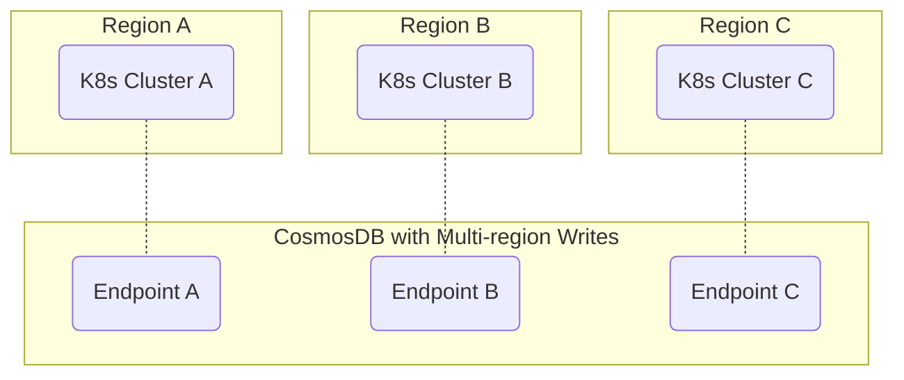

# Multi-region AKS

Multi-region Azure Kubernetes Service (AKS) managed by Terraform or Opentofu.

```mermaid
flowchart TD
  subgraph Region A
    ka("K8s Cluster A")
  end
  subgraph Region B
    kb("K8s Cluster B")
  end
  subgraph Region C
    kc("K8s Cluster C")
  end
  subgraph CosmosDB with Multi-region Writes
    ca("Endpoint A")
    cb("Endpoint B")
    cc("Endpoint C")
  end
  ka -.- ca
  kb -.- cb
  kc -.- cc
```
