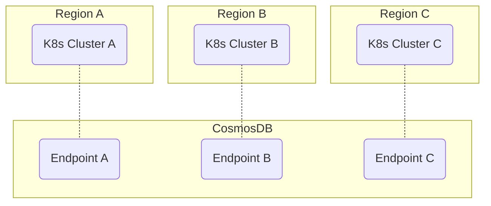

# Multi-region AKS

Multi-region Azure Kubernetes Service (AKS) managed by Terraform or Opentofu.

## Background

This project originated from our efforts to deploy the backend of a real-time
multiplayer game. Such games demand low network latency, making
multi-regional Kubernetes clusters an ideal solution.

For game workloads, online user traffic can surge unexpectedly (e.g. a global
App Store promotion can cause a 10× increase in concurrent players within an
hour). To handle these bursts, we relied on node pools with autoscaling enabled.

Since cloud cost optimization was critical, we prioritized the use of *Spot
instances* wherever possible. Kubernetes *node labels* and *taints* were configured
to distinguish between *Regular* and *Spot* node pools, while backend
deployments applied *node affinity* and *taint tolerations* to ensure
workloads were scheduled appropriately.

We also wanted cross-region gameplay, where players from different regions
could team up and share the same game state. This required storing user data in
a single database while maintaining low latency between each Kubernetes
cluster and its local database endpoint. Azure CosmosDB came into place.

For development, we used MongoDB (due to historical reasons). In production,
we chose Azure CosmosDB with MongoDB API compatibility, for two key reasons:

- Latency: MongoDB does not support multi-region writes, whereas CosmosDB does.
- Scalability and Operations: MongoDB scaling incurs more operational overhead.
  In contrast, CosmosDB scales automatically, supports pay-as-you-go *RU-based
  pricing*, and eliminates over-provisioning.

The result: low latency, high availability, burst handling, cost efficiency, and
unified data across regions.

## Infrastructure as Code

Refer to [./infra/README.md](./infra/README.md) and [./infra/azure-aks/README.md](./infra/azure-aks/README.md).
